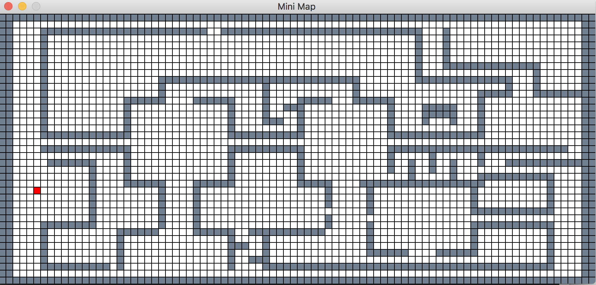

# 42 Project: Wold 3d

This program was made to recreate the look and feel of the classic 90s game, Wolfenstein 3D. 42's basic MLX library was used for the graphics and textures are borrowed from the orginal game.

## Getting Started

### Compiling

Run the following commands:

* To compile
	- `make`
* To remove objects:
	- `make clean`
* To remove objects and binary file (program):
	- `make fclean`
* To re-compile:
	- `make re`

### Executing

To execute the program:

`./wolf <map>`

*Maps are available in the maps directory*

#### Try it!

Try running the following:

`./wolf maps/large.fdf`

`./wolf maps/huge.fdf`

## Screenshots

**Program running:**

